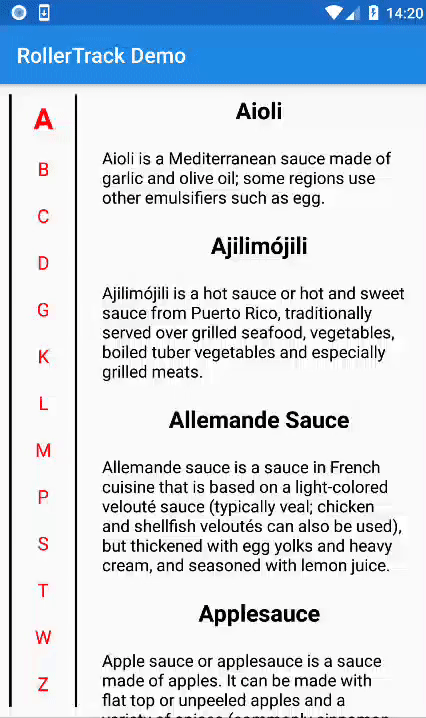
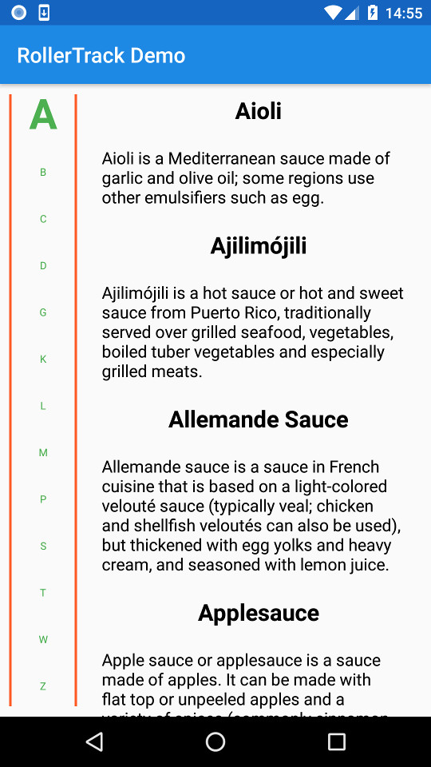

# RollerTrack
This library allows attaching a roller track to a RecyclerView. The roller track provides faster navigation and visualisation for users 
facing long lists. It is designed to work with sorted lists of related content with fixed, pre-determined datasets. Example good use cases are a catalogue of items grouped alphabetically or a list of events grouped by starting time.



## Usage
Start by adding your `RecyclerView` and `RollerTrack` to your layout file. You are free to position these however you want.

```kotlin
<LinearLayout
    xmlns:android="http://schemas.android.com/apk/res/android"
    android:orientation="horizontal"
    android:layout_width="match_parent"
    android:layout_height="match_parent">

    <com.tofi.rollertrack.rollertrack.RollerTrack
        android:id="@+id/roller_track"
        android:layout_width="0dp"
        android:layout_height="match_parent"
        android:layout_weight="0.2"
        android:paddingTop="10dp"
        android:paddingBottom="10dp"
        android:paddingLeft="10dp"
        android:paddingRight="10dp"/>

    <android.support.v7.widget.RecyclerView
        android:id="@+id/list_track_items"
        android:layout_width="0dp"
        android:layout_height="match_parent"
        android:layout_weight="0.8"
        android:clipToPadding="false"/>

</LinearLayout>
```

Next have your data model implement `AlphabeticalTrackItem`

```kotlin
data class DemoTrackItem(var title: String = "",
                         var description: String = ""): AlphabeticalTrackItem {

    override fun getTrackItemName(): String = title
}
```

Then sort your list of items, set up your `RecyclerView` normally and attach it to an `AlphabeticalTrackRollerHelper`

```kotlin
val trackItems: List<DemoTrackItem> = loadTrackItems().sortedBy { it.title }

val adapter = RollerTrackAdapter(trackItems)
list_track_items.adapter = adapter

val layoutManager = LinearLayoutManager(this, LinearLayoutManager.VERTICAL, false)
list_track_items.layoutManager = layoutManager

val rollerTrackHelper: AlphabeticalRollerTrackHelper<DemoTrackItem> = AlphabeticalRollerTrackHelper()
rollerTrackHelper.attachToRecyclerView(list_track_items, roller_track, trackItems)
```

If you wish to create your own list of `RollerTrackItem`s, just extend `RollerTrackHelper` and return your own items in `generateRollerTrackItems`.

```kotlin
class CityRollerTrackHelper: RollerTrackHelper<City>() {

    override fun generateRollerTrackItems(listItems: List<City>): MutableList<RollerTrackItem<City>> {
        val rollerTrackItems = mutableListOf<RollerTrackItem<City>>()

        var currentRollerTrackItemData: MutableList<City> = mutableListOf()
        var currentRollerTrackItem: RollerTrackItem<City> = RollerTrackItem("", currentRollerTrackItemData)
        listItems.forEach {
            val countryCode = it.countryCode
            
            if (currentRollerTrackItem.trackItemName != countryCode) {
                currentRollerTrackItemData = mutableListOf()
                currentRollerTrackItemData.add(it)
                currentRollerTrackItem = RollerTrackItem(countryCode, currentRollerTrackItemData)
                rollerTrackItems.add(currentRollerTrackItem)

            } else {
                currentRollerTrackItemData.add(it)
            }
        }

        return rollerTrackItems
    }
}
```

## Customisation
You can customise the appearance of the `RollerTrack` with xml styling. 

```kotlin
<com.tofi.rollertrack.rollertrack.RollerTrack
        xmlns:demo="http://schemas.android.com/apk/res-auto"
        android:id="@+id/roller_track"
        android:layout_width="0dp"
        android:layout_height="match_parent"
        android:layout_weight="0.2"
        android:paddingTop="10dp"
        android:paddingBottom="10dp"
        android:paddingLeft="10dp"
        android:paddingRight="10dp"
        demo:rollerTrackTrackLineColor="#FF5722"
        demo:rollerTrackTextColor="#4CAF50"
        demo:rollerTrackCurrentItemTextSize="40sp"
        demo:rollerTrackBackgroundItemTextSize="10sp"/>
```



## Demo
A demo is provided under the `demo` module. Clone this repo and run the demo app to see it in action.

## License
Provided with MIT license. See [LICENSE](LICENSE.md) for full details.
